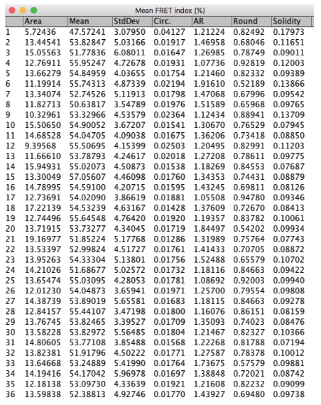
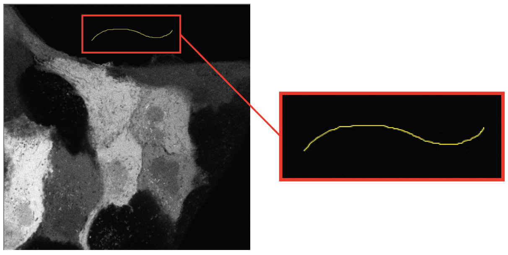
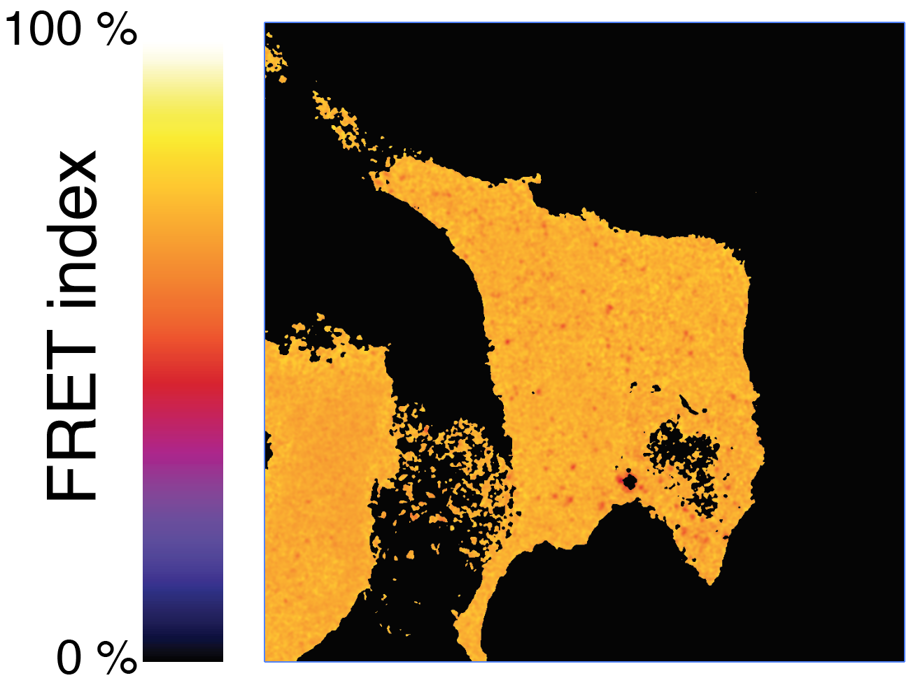

# nuclearFRET
an [ImageJ](http://imagej.net/Welcome)/[Fiji](https://fiji.sc) python script for [FRET](https://en.wikipedia.org/wiki/Förster_resonance_energy_transfer) (Förster Resonance Energy Transfer) calculation at the nuclear envelope or in the cytoplasm for FRET standard constructs.
This protocol is derived from a previously published work: [Déjardin *et al.*, *J Cell Biol* (2020) 219 (10): e201908036](https://doi.org/10.1083/jcb.201908036).

The script generates either the FRET index map of semi-automatically extracted nuclear envelopes from nuclei and a list of mean FRET index per nucleus ([**Nuclei workflow**](#nuclei-workflow)), or the FRET index map of FRET standard constructs 5AA and TRAF expressed in the cytoplasm ([**Whole cell workflow**](#whole-cell-workflow)).  

## Installation

* Download the [python script file](https://github.com/phigirard/nuclearFRET/blob/main/nuclearFRET.py) into your computer.
* Use File > Open…  to open the script `nuclearFRET.py` in ImageJ/Fiji.
* Click Run on the bottom of the script editor window (you can also go to : Run > Run in the Script Fiji menu).  

 

## Nuclei workflow

1.	In the dialog box :
	* 	select the multichannel ZEISS .lsm or .czi file (it is also working for multi-tif file) you wish to analyze,
	*  select one of the two image analysis workflows: [*Nuclei*] option to analyze the signal from nuclear envelope,
	*  select [*Choose values for background subtraction*] if you want to subtract the background intensity levels by inserting manually the background values in the corresponding Donor/Acceptor channel numeric fields. This option will bypass the background measurement from a ROI (Region Of Interest) in the acquired images (step 4). 

 
2.	The script opens the file and checks its dimension. If the number of Z-slices or frames is >1 (Z or T >1) or if there is only one channel (C=1), the script will abort and warn the user. If the file contains multiple positions, select with the slider in the popup window the serie you want to analyze. The script creates a folder with the name *filename(without extension)_Sselected series number* to store all the analyzed data files (images and result tables).
3. The script displays the Maximum Intensity Projection (MIP) generated from the multichannel stack. In this image, manually select with the rectangular tool a ROI where the signal localizes.  

  The script then displays the mean intensity profile of this ROI through the multichannel image, which reveals the fluorescence emission spectrum of the construct. In the popup, select the channels that correspond to the donor and acceptor intensity maxima based on the emission spectrum.  
  The script will extract the selected channels and proceed to the next step on them. 

 
4. The script applies a Gaussian filter with a radius of 2 pixels to both channels in order to reduce noise and assigns Not A Number (NaN) value to saturated and 0-value pixels. In the image window, manually select a line ROI with the freehand line tool in the darkest area of the image. 

  For each channel, the script measures the mean intensity value within the ROI and subtract it from the whole image. Each background-subtracted channel is saved in the ‘analyzed data folder created in step 2 (`c1: donor` and `c2:  acceptor` images).
5.	The script generates a FRET index image (in %) from the background-corrected and thresholded donor and acceptor images by applying the following formula to each non-NaN pixel:  

  where IFRET and IDonor are the intensity values in the acceptor and donor channels, respectively. The resulting image is saved as `FRET index (%).tif`. 

 
6. 	In the MIP image, manually point with the multi-point selection tool all nuclei. 

  The coordinates of these markers are saved as a set of ROIs under the name `RoiSet_Markers.zip`. The script segments all selected regions with the Marker-controlled Watershed plugin from the MorphoLibJ library.  

 
7. In the segmented image, select background regions to fuse with the multi-point selection tool.  

  The function [Merge Label and Kill border] of the MorphoLibJ library then merges together the selected background regions and removes the selected regions touching the border of the image. The resulting image with the Jet color map and white background is saved as `LabelBordersRGB.tif`. 

 
8. The script then interpolates labeled nuclei in closed polygon ROIs with points spaced one pixel apart by applying a 3-point running average. Polygons with less than 10 points are discarded. The set of resulting ROIs are saved as `RoiSet_NucleiContour.zip`.  

  A 3-pixels-thick band is then generated from each ROI. The set of resulting ROIs is saved as `RoiSet_NucleiBand.zip`.  

  A Result Table is generated with one row per pixel within the band of each nucleus contour and the following columns: the index of the nucleus (IObject), the ROI name of the nucleus given by ROI Manager (Iname), the index of the pixel within the band (IcontourPoints), the coordinates of this pixel (PointX and PointY) and the FRET index in % of this pixel (FRET index (%)). The table is saved as `ContourMeasurements.csv`.
9. The script sets all pixels excluded from the 3-pixels thick nucleus contour to NaN in the FRET index image obtained in step 5 and displays: 
	-	an image where the pixel values in the nucleus contour are the FRET indices in % with a Fire color map. This image is saved as `FRET index Nuclei.tif`.  

 
	-	a Result Table called 'Mean FRET index (%)' with, for each nucleus, its area (in the physical unit of the original image), the mean FRET index (in %) and the standard deviation measured in the nuclear band, the shape descriptors (circularity, aspect ratio, roundnessand solidity) of the nucleus contour. This table is saved as `MeanFRETMeasurements.csv`.  

 

## Whole cell workflow

1.	In the dialog box :
	*  select the multichannel ZEISS .lsm or .czi file (it is also working for multi-tif file) you wish to analyze,
	*  select one of the two image analysis workflows: [*Whole cell*] option to analyze the signal from the cytoplasm,
	*  select [*Choose values for background subtraction*] if you want to subtract the background intensity levels by inserting manually the background values in the corresponding Donor/Acceptor channel numeric fields. This option will bypass the background measurement from a ROI (Region Of Interest) in the acquired images (step 4). 

 
2.	The script opens the file and checks its dimension. If the number of Z-slices or frames is >1 (Z or T >1) or if there is only one channel (C=1), the script will abort and warn the user. If the file contains multiple positions, select with the slider in the popup window the serie you want to analyze. The script creates a folder with the name *filename(without extension)_Sselected series number* to store all the analyzed data files (images and result tables).
3. The script displays the Maximum Intensity Projection (MIP) generated from the multichannel stack. In this image, manually select with the rectangular tool a ROI where the signal localizes.  

  The script then displays the mean intensity profile of this ROI through the multichannel image, which reveals the fluorescence emission spectrum of the construct. In the popup, select the channels that correspond to the donor and acceptor intensity maxima based on the emission spectrum.  
  The script will extract the selected channels and proceed to the next step on them. 

 
4. The script applies a Gaussian filter with a radius of 2 pixels to both channels in order to reduce noise and assigns Not A Number (NaN) value to saturated and 0-value pixels. In the image window, manually select a line ROI with the freehand line tool in the darkest area of the image. 

  For each channel, the script measures the mean intensity value within the ROI and subtract it from the whole image. Each background-subtracted channel is saved in the ‘analyzed data folder created in step 2 (`c1: donor` and `c2:  acceptor` images).
5.	In the popup window, select the min and max intensity values of the pixels for which you want to display the FRET index with the threshold sliders. Press `OK’ to generate thresholded donor and acceptor images in which the foreground pixels retain their original values, while background pixels are set to NaN.  

 
6. The script generates a FRET index image (in %) from the background-corrected and thresholded donor and acceptor images by applying the following formula to each non-NaN pixel:  

  where IFRET and IDonor are the intensity values in the acceptor and donor channels, respectively.  
The script will then display:
	-	an image where every selected pixel displays a FRET index value in % with a ‘Fire’ color map. The resulting image is saved as `FRET index (%).tif`, 

 
	-	a single row Result Table called `Mean FRET index (%)` with the area (in the unit of the original image) of the analyzed region, the mean FRET index and its standard deviation. This table is not saved.  

 

